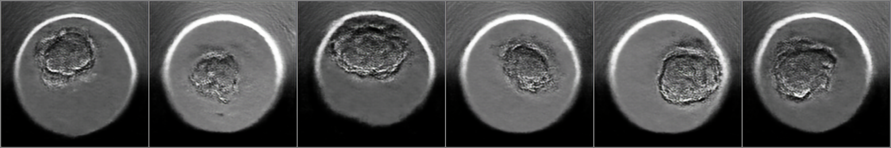

# GANs
### i. Implementation of DCGAN in pytorch for generating images from random noises.
### ii. Implemetation of WGAN with gradient penalty in pytorch for generating images from random noises.

## Real image : 

## Image After 5 epochs of  training : 

## Image after 50 epochs of training : 

